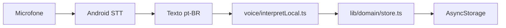

# AGENTS.md — DuDia

Guia para agentes de IA trabalhando neste repositório. Para humanos, use o [README.md](README.md).

> Formato baseado em [agents.md](https://agents.md/). Cada subpasta importante tem um `AGENTS.md` aninhado com regras específicas. Em conflito, vence o `AGENTS.md` mais próximo do arquivo editado, e instruções explícitas do usuário no chat vencem tudo.

## Visão geral

DuDia é um app **Android-first** (Expo + React Native + expo-router) para feirantes registrarem vendas e estoque por **voz** ou **toque**.

- 100% offline: AsyncStorage local + interpretação local de comandos de voz (`src/lib/voice/interpretLocal.ts`).
- Sem backend, sem `.env` obrigatório, sem Supabase.
- **Não roda no Expo Go**: requer build nativo (microfone + reconhecimento de voz).



## Setup

```bash
npm install
npx expo prebuild --platform android   # apenas na primeira vez ou após mudança nativa
```

Pré-requisitos do host: Node 20+, JDK 17+, Android SDK com `adb` no PATH.

## Comandos

| Comando | Função |
|---|---|
| `npm start` | Metro bundler (terminal 1, deixar aberto) |
| `npm run logs` | Logs `adb logcat` filtrados (terminal 2) |
| `npm run android` | Build nativo + instala no celular USB (terminal 3) |
| `npm run android:direct` | Igual, sem verificar deps |
| `npm run emu` | Sobe emulador Android com GPU segura (Linux) |
| `npm run build:apk` | Gera APK release (`android/app/build/outputs/apk/release/`) |
| `npx tsc --noEmit` | Smoke test de tipos (usar antes de commitar) |

Não há lint configurado; o TypeScript em modo `strict` é o checker principal.

## Convenções de código

- **TypeScript estrito**. Nunca usar `any`; preferir tipos explícitos exportados de `src/types/` ou `src/lib/voice/interpretLocal.ts`.
- **Imports** sempre via alias `@/src/...` (configurado em [tsconfig.json](tsconfig.json)). Nunca caminhos relativos `../../`.
- **Sem comentários narrativos** (`// Importa X`, `// Retorna Y`). Comentários só para intenções não-óbvias.
- **Estilos** com `StyleSheet.create` no fim do arquivo da tela/componente; usar tokens do tema (`useTheme()` ou `colors` legado), nunca cores hardcoded.
- **Strings em português** para qualquer texto visível ao usuário.
- **Feedback tátil/sonoro** via `feedback("ok"|"warn"|"err")` de `src/lib/utils/feedback.ts` em toda ação destrutiva ou de confirmação.
- **AsyncStorage**: sempre via wrappers em `src/lib/storage/` — nunca importar `@react-native-async-storage/async-storage` direto em telas.

## Estrutura

```
app/                  # Rotas expo-router (thin wrappers que reexportam de src/features)
src/
  app-shell/          # Providers globais (AppBootstrap, Theme)
  features/           # Uma pasta por aba: vendas/produtos/balanco/historico/perfil
  components/ui/      # Design system reutilizável
  hooks/              # Hooks cross-feature
  lib/
    domain/           # Regras de negócio (store, sales helpers)
    voice/            # NLU local pt-BR
    storage/          # AsyncStorage + settings
    utils/            # Feedback, imagens
  theme/              # Tokens light/dark, ThemeProvider, tipografia
  types/              # Tipos compartilhados
assets/               # Ícones e splash
android/              # Gerado por expo prebuild — NUNCA editar à mão
```

Detalhes por camada em `app/AGENTS.md`, `src/AGENTS.md`, `src/features/AGENTS.md` e `android/AGENTS.md`.

## Gotchas

- **Pasta `android/`** é gerada por `expo prebuild`. Mudanças nativas vão em [app.json](app.json) e ressincronizam com `npx expo prebuild --platform android --clean`.
- **expo-speech-recognition**: o callback `onResult` em `useSpeech` é chamado **no evento `end`** com a transcrição final acumulada. Não dispare lógica pesada dentro de `result` (interim).
- **`store.addSale`** ajusta estoque internamente — não chame `adjustStock` adicionalmente após `addSale`.
- **Quantidades**: produtos `un` são inteiros, `kg` aceitam decimais. Sempre arredondar com `toFixed(3)` em operações de estoque.
- **Imagens base64**: redimensionar via `uriToResizedDataUrl(uri, 320)` antes de persistir, para não estourar AsyncStorage.

## Padrão de commits

Conventional commits curtos em inglês: `feat: ...`, `fix: ...`, `refactor: ...`, `chore: ...`, `docs: ...`.

## Antes de finalizar uma tarefa

1. `npx tsc --noEmit` deve passar sem erros.
2. Se mexeu em telas, conferir manualmente no celular/emulador.
3. Se mudou dependências nativas ou `app.json`, rodar `npx expo prebuild --platform android` e avisar o usuário para reinstalar o build.
